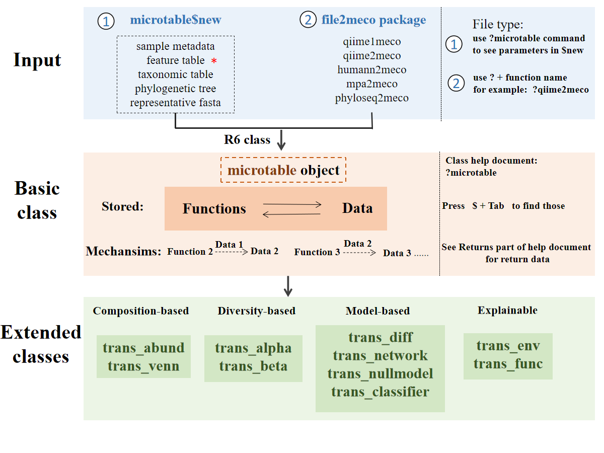

# 前言 {.unnumbered}

欢迎来到《数据驱动的可重复性研究》课程第六讲：使用 R 语言进行微生物组数据分析。本讲将系统介绍微生物组数据分析的原理、方法和实践操作，帮助您掌握从原始测序数据到生物学解释的完整分析流程。

## 微生物组研究概述

微生物组（Microbiome）是指特定环境中所有微生物及其遗传物质的总和，包括细菌、古菌、真菌、病毒等。随着高通量测序技术的发展，16S rRNA 基因扩增子测序已成为研究微生物群落组成和多样性的主流方法。通过分析微生物组数据，我们可以：

- **揭示群落组成**：了解样本中存在的微生物种类及其相对丰度
- **评估群落多样性**：从 Alpha 多样性（样本内）和 Beta 多样性（样本间）两个维度刻画群落特征
- **识别生物标志物**：发现与特定环境条件或宿主状态相关的关键微生物类群
- **解析共现网络**：构建微生物间的相互作用网络，推断生态关系

## 分析流程概览

本讲涵盖微生物组数据分析的完整流程。下图展示了 `microeco` 包的整体分析框架：

```{r}
#| echo: false
#| label: fig-microeco-framework
#| fig-cap: "microeco 包的分析框架"

```

### 本讲内容组织

1. **测序数据预处理**（[第一章](preprocess.qmd)）：使用 DADA2 对原始测序数据进行质量控制、去噪和 ASV（Amplicon Sequence Variants）推断
2. **构建 microtable 对象**（[第二章](microtable.qmd)）：将数据整理为 microeco 包所需的格式，建立标准化分析基础
3. **群落结构分析**（[第三章](taxonomy.qmd)）：可视化物种组成，了解群落的基本特征
4. **Alpha 多样性分析**（[第四章](alpha.qmd)）：评估样本内的物种丰富度和多样性
5. **Beta 多样性分析**（[第五章](beta.qmd)）：比较不同样本间的群落差异
6. **差异分析**（[第六章](differ.qmd)）：鉴定在不同处理组间显著差异的微生物类群
7. **网络分析**（[第七章](network.qmd)）：构建微生物共现网络，解析物种间的相互作用

## 示例数据说明

本讲使用一组土壤微生物组数据作为示例。该数据来自栗河（LiHe）地区的土壤样本，包含三种不同处理组（ZY0、ZY0.5、ZY1），每组 4 个生物学重复，共计 12 个样本。测序 targeting 16S rRNA 基因的 V4 区，使用 Illumina MiSeq 平台进行双端测序（2×250 bp）。同时，我们还收集了每个样本的环境因子数据，包括 pH、电导率（EC）、总有机碳（TOC）和总有机质（TOM）。

## 软件环境

本讲主要使用以下 R 包进行数据分析：

- **dada2**：用于原始测序数据的预处理和质量控制
- **microeco**：用于微生物组数据的全面分析和可视化
- **tidyverse**：用于数据整理和可视化

请确保在运行本讲代码前已安装并加载了这些包。同时，本讲使用 `renv` 包管理 R 环境依赖，以确保分析的可重复性。

## 核心概念速览

在开始之前，让我们快速了解本讲涉及的几个核心概念：

### ASV 与 OTU

- **ASV (Amplicon Sequence Variants，扩增子序列变体)**：基于精确序列差异（单核苷酸分辨率）定义的微生物单元。DADA2 等工具通过错误率校正将相似序列聚合成 ASV，能够区分仅相差一个碱基的序列。
- **OTU (Operational Taxonomic Unit，操作分类单元)**：传统的聚类方法，通常基于 97% 序列相似度将序列分组。OTU 可能掩盖真实的生物学变异。

**为何选择 ASV？** ASV 提供了更高的分辨率，能够检测细微的序列差异，且结果在不同研究间更具可比性（ASV 是"精确的标签"，而非依赖于特定聚类阈值）。

### microtable 对象

`microtable` 是 **microeco** 包的核心数据结构，类似于 **phyloseq** 包的 `phyloseq` 对象。它将微生物组分析的三大核心数据表整合在一起：

- **OTU/ASV 表**：特征（微生物）× 样本的丰度矩阵
- **样本表**：样本的元数据（分组、环境因子等）
- **分类表**：特征的分类学注释（界/门/纲/目/科/属/种）

构建 `microtable` 对象是所有后续分析的基础，本书将在第二章详细讲解其构建方法。

### 组成性效应 (Compositional Effect)

微生物组数据是**组成性数据**——每个样本的序列总数（测序深度）是固定的，因此一个分类群的相对丰度增加必然意味着其他分类群的相对丰度减少。这会导致"虚假相关"现象：

- 两个分类群可能在统计上负相关，但这只是因为第三个分类群丰度增加
- 差异分析时需要特别注意，某分类群的"富集"可能是绝对丰度增加，也可能只是其他分类群减少

本书将在差异分析和网络分析章节讨论如何缓解组成性效应的影响。

## 使用说明

本书中的所有代码均可直接在 R 环境中运行。建议读者在阅读时同步执行代码，以加深理解。

::: {.callout-tip}
### 环境准备

从课程仓库下载本课程的源代码：

```bash
git clone git@github.com:D2RS-2026spring/lecture6-r-microbiome-analysis.git
```

在开始学习之前，请确保你的 R 版本 ≥ 4.1.0，并已安装以下软件包：

```{r}
#| results: asis
cat(paste0("本次使用的 R 版本：", R.version.string))
```

```r
install.packages("pak")  # 推荐使用 pak 包安装
pak::pak(c("tidyverse", "microeco", "dada2", "ggplot2",
           "cowplot", "pheatmap", "vegan", "randomForest"))
```

如果你了解 `renv`，还可以一键创建一个可重复的本地分析环境。

```r
renv::restore()
```

然后在终端运行 `quarto render --to html` 编译全书内容[^1]。

[^1]: 本项目推荐使用 [Positron](https://positron.posit.co/) 作为开发环境。用 Positron 打开本项目后，`renv` 会自动识别并恢复依赖环境，Quarto 文档也可以直接预览和渲染。如果运行 `quarto render` 将同时生成 HTML 和 PDF。因 PDF 渲染配置容易出问题，所以如果出错，推荐先生成 HTML 文档。
:::

## 学习建议

- 每个章节都按照"概述-流程-实现-结果"的结构组织，建议按顺序阅读
- 代码块可以直接运行，但也鼓励您根据实际数据进行调整
- 理解分析背后的生物学意义比单纯运行代码更重要
- 注意记录分析过程中的参数设置和关键决策，以保证研究的可重复性

希望本讲能帮助您建立系统的微生物组数据分析思维，祝学习愉快！
