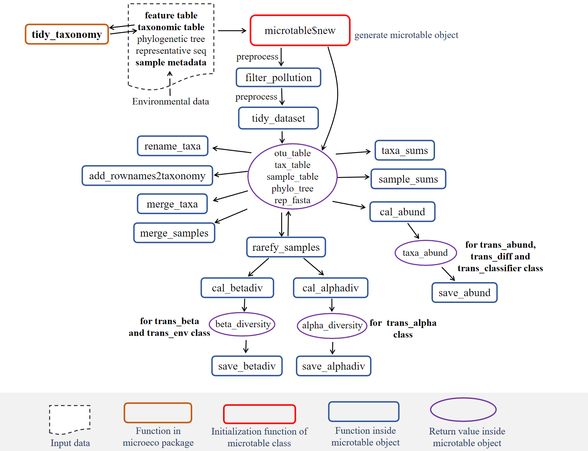

# 群落结构分析

## 概述

在前一章中，我们使用 DADA2 对原始测序数据进行了预处理，得到了 ASV 表、分类表和样本表。本章将基于这些数据进行**群落结构分析**——微生物组数据分析的第一步。

### 什么是群落结构分析？

群落结构分析旨在回答两个基本问题：

1. **"样本中存在哪些微生物？"** —— 识别群落的成员组成
2. **"它们的相对丰度如何？"** —— 了解各成员在群落中的占比

通过可视化物种组成，我们可以：

- **了解群落概貌**：识别优势菌群，把握群落的基本特征
- **发现组间差异**：比较不同处理组间的组成差异，形成初步假设
- **指导后续分析**：为差异分析、网络分析等提供线索

### 为何群落结构分析是第一步？

在微生物组数据分析的标准流程中，群落结构分析通常作为**探索性数据分析（EDA）**的起点：

1. **数据质量检查**：通过物种组成图可以直观发现异常样本（如某样本组成与其他重复差异极大，可能存在污染）
2. **初步假设生成**：肉眼观察到的组间差异可以指导后续的统计检验方向
3. **分析可行性评估**：判断样本分组是否合理，是否需要调整分组策略

### microtable 对象：分析的基础

本章所有分析都基于 `microtable` 对象。下图展示了 `microtable` 的内部结构和关键函数：

```{r}
#| echo: false
#| label: fig-microtable-framework
#| fig-cap: "microtable 对象结构框架"

```

*图注：矩形框内为函数，红色矩形表示重要函数，虚线框表示需要关注的关键对象*

`microtable` 对象整合了三大核心数据表：

- **otu_table**：ASV × 样本的丰度矩阵
- **sample_table**：样本的元数据（如处理组、环境因子）
- **tax_table**：ASV 的分类学注释

本章将通过 `trans_abund` 类对 `microtable` 对象进行转化和可视化。

### 分析内容

物种组成分析通常在多个分类等级（门、纲、目、科、属）进行，以不同分辨率展示群落结构。常用的可视化方式包括：

| 图表类型 | 适用场景 | 优势 |
|---------|---------|------|
| 堆叠柱状图 | 展示各样本的物种组成比例 | 直观比较组间差异 |
| 热图 | 展示高丰度物种在各样本中的分布 | 适合大量分类群，可聚类 |
| 箱线图 | 比较不同组间某分类群的丰度分布 | 显示组内变异和统计差异 |
| 饼图 | 展示组平均组成的整体比例 | 适合展示整体构成 |

## 流程

在 `microeco` 包中，群落结构分析主要通过 `trans_abund` 类实现，其工作流程如下：

1. **数据准备**：确保 `microtable` 对象已正确构建，包含 OTU/ASV 表、样本表和分类表
2. **创建分析对象**：使用 `trans_abund$new()` 初始化分析对象，指定目标分类等级（如 Phylum、Genus）
3. **可视化**：调用相应的绘图函数生成各种图表

`trans_abund` 类支持多种图表类型：

| 图表类型 | 函数 | 适用场景 |
|---------|------|---------|
| 堆叠柱状图 | `plot_bar()` | 展示各样本的物种组成比例 |
| 热图 | `plot_heatmap()` | 展示高丰度物种在各样本中的分布 |
| 箱线图 | `plot_box()` | 比较不同组间某分类群的丰度分布 |
| 饼图 | `plot_pie()` | 展示组平均组成的整体比例 |

## 实现





### 门水平的物种组成

首先，我们在门（Phylum）水平上分析物种组成。这有助于把握群落的整体框架，因为门水平的分类群数量相对较少，易于解释。

```{r}
#| label: fig-phylum-bar
#| fig-cap: "门水平物种组成的堆叠柱状图"
#| fig-width: 10
#| fig-height: 6

t1 = trans_abund$new(dataset = mt, taxrank = "Phylum", ntaxa = 8)
t1$plot_bar(xtext_angle = 45, facet = "treatment", xtext_keep = FALSE)
```

**参数说明**：

- `taxrank = "Phylum"`：指定在门水平汇总数据
- `ntaxa = 8`：选择丰度最高的 8 个门，其余归为 "Others"
- `facet = "treatment"`：按处理组分面展示
- `xtext_keep = FALSE`：不显示样本名称，使图形更简洁

### 纲水平的物种组成

进一步在纲（Class）水平上分析，可以获得更精细的分类信息。

```{r}
#| label: fig-class-bar
#| fig-cap: "纲水平物种组成的堆叠柱状图"
#| fig-width: 10
#| fig-height: 6

t1 = trans_abund$new(dataset = mt, taxrank = "Class", ntaxa = 15)
t1$plot_bar(xtext_angle = 45, facet = "treatment", xtext_keep = FALSE)
```

### 属水平的热图

热图是展示大量分类群在多个样本中分布模式的有效方式。我们在属（Genus）水平上绘制热图，以观察高丰度属的分布特征。

```{r}
#| label: fig-genus-heatmap
#| fig-cap: "属水平物种丰度热图"
#| fig-width: 10
#| fig-height: 8

t1 = trans_abund$new(dataset = mt, taxrank = "Genus", ntaxa = 30)
t1$plot_heatmap(pheatmap = TRUE, facet = "treatment")
```

**热图解读要点**：

- 颜色深浅表示相对丰度的高低（通常颜色越深丰度越高）
- 行聚类显示分类群在样本间的相似分布模式
- 列聚类显示样本间的组成相似性

### 箱线图比较组间差异

箱线图可以直观地展示特定分类群在不同处理组间的丰度分布差异。

```{r}
#| label: fig-phylum-box
#| fig-cap: "门水平主要分类群的组间丰度分布"
#| fig-width: 10
#| fig-height: 6

t1 = trans_abund$new(dataset = mt, taxrank = "Phylum", ntaxa = 5)
t1$plot_box(group = "treatment", xtext_angle = 0)
```

## 结果

### 群落组成特征

从门水平的分析结果（@fig-phylum-bar）可以看出，本研究土壤微生物组主要由以下几个门组成：

- **变形菌门（Proteobacteria）**：通常是最丰富的门之一，包含多种代谢类型的细菌
- **放线菌门（Actinobacteria）**：在土壤中广泛分布，参与有机物分解
- **酸杆菌门（Acidobacteria）**：土壤中的常见类群，适应酸性环境
- **芽孢杆菌门（Bacillota，原 Firmicutes）**：包含多种芽孢形成菌

### 处理组间差异的初步观察

通过对比不同处理组（ZY0、ZY0.5、ZY1）的柱状图，我们可以初步观察到：

1. **优势门的相对比例变化**：某些门在不同处理组间的相对丰度可能存在差异，这可能反映了处理条件对微生物群落的选择作用
2. **群落均匀度**：各组内样本的重复性较好，表明组内变异相对较小

### 热图揭示的精细模式

属水平的热图（@fig-genus-heatmap）揭示了更精细的分布模式：

- **核心微生物组**：某些属在所有样本中均有较高丰度，可能代表土壤微生物组的核心功能类群
- **处理组特异性**：部分属在特定处理组中富集，这些类群可能是后续差异分析的重点关注对象

### 分析与讨论

群落结构分析的结果为理解处理效应提供了初步线索。在本案例中：

1. **环境适应性**：不同处理条件（ZY0、ZY0.5、ZY1 可能代表不同施肥或处理强度）可能塑造了不同的微生物群落结构，反映了微生物对环境变化的适应

2. **功能推断**：基于已知的分类群功能特征，我们可以初步推测：
   - 某些参与养分循环的门（如 Proteobacteria 和 Actinobacteria）的丰度变化可能与土壤肥力相关
   - 酸杆菌门的相对丰度可能与土壤 pH 条件有关

3. **后续分析方向**：群落结构分析的结果可指导后续分析：
   - 对于在柱状图中肉眼可见组间差异的分类群，可通过差异分析进行统计验证
   - 热图中聚类在一起的分类群可能在功能上相关，可作为网络分析的候选对象

**注意事项**：物种组成分析展示的是相对丰度数据，在解释时需要注意组成性效应（Compositional effect），即一个分类群的相对丰度增加可能是由于其他分类群减少所致，而非其绝对丰度真正增加。

## 💡 小提示

**microeco** 包的使用文档参见：<https://chiliubio.github.io/microeco_tutorial>。

- 使用 `tidy_taxonomy()` 函数确保分类表格式统一，特别是处理未知分类等级时
- 绘制热图时，`pheatmap = TRUE` 参数可以生成更美观的聚类热图
- 箱线图中添加 `add_sig = TRUE` 参数可以显示统计显著性标记（需先运行差异分析）
